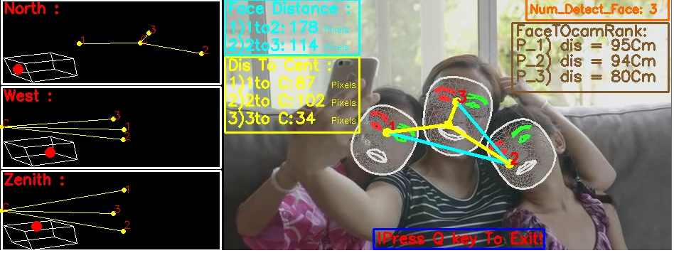

## Fast Human Face recognition and Face meshing in video considering aspects of Data Visualization

Mohammad-Iman Hossein-Nia & M. B. Ghaznavi-Ghoushchi





Notice: The path **/usr/local/mypython/lib** in the following sections may be different for your installation.


________________________________________________________________________________________________________________________________

### 1) Install the required packages
#### 1.1) Upgrade pip :


```python
! pip install --upgrade pip
```

    Requirement already satisfied: pip in /usr/local/mypython/lib/site-packages (23.0)
    Collecting pip
      Downloading pip-23.0.1-py3-none-any.whl (2.1 MB)
         ---------------------------------------- 2.1/2.1 MB 67.5 kB/s eta 0:00:00
    

    [notice] A new release of pip is available: 23.0 -> 23.0.1
    [notice] To update, run: python.exe -m pip install --upgrade pip
    

#### 1.2) Install Opencv :


```python
! pip install opencv-python
```

    Requirement already satisfied: opencv-python in /usr/local/mypython/lib/site-packages (4.7.0.68)
    Requirement already satisfied: numpy>=1.17.3 in /usr/local/mypython/lib/site-packages (from opencv-python) (1.19.5)
    

    [notice] A new release of pip is available: 23.0 -> 23.0.1
    [notice] To update, run: python.exe -m pip install --upgrade pip
    

#### 1.3) Install  mediapipe : 


```python
! pip install mediapipe
```

    Requirement already satisfied: mediapipe in /usr/local/mypython/lib/site-packages (0.9.1.0)
    Requirement already satisfied: numpy in /usr/local/mypython/lib/site-packages (from mediapipe) (1.19.5)
    Requirement already satisfied: attrs>=19.1.0 in /usr/local/mypython/lib/site-packages (from mediapipe) (21.4.0)
    Requirement already satisfied: protobuf<4,>=3.11 in /usr/local/mypython/lib/site-packages (from mediapipe) (3.19.1)
    Requirement already satisfied: absl-py in /usr/local/mypython/lib/site-packages (from mediapipe) (1.4.0)
    Requirement already satisfied: opencv-contrib-python in /usr/local/mypython/lib/site-packages (from mediapipe) (4.7.0.68)
    Requirement already satisfied: flatbuffers>=2.0 in /usr/local/mypython/lib/site-packages (from mediapipe) (23.1.21)
    Requirement already satisfied: matplotlib in /usr/local/mypython/lib/site-packages (from mediapipe) (3.6.2)
    Requirement already satisfied: python-dateutil>=2.7 in /usr/local/mypython/lib/site-packages (from matplotlib->mediapipe) (2.8.2)
    Requirement already satisfied: cycler>=0.10 in /usr/local/mypython/lib/site-packages (from matplotlib->mediapipe) (0.11.0)
    Requirement already satisfied: pillow>=6.2.0 in /usr/local/mypython/lib/site-packages (from matplotlib->mediapipe) (9.0.1)
    Requirement already satisfied: packaging>=20.0 in /usr/local/mypython/lib/site-packages (from matplotlib->mediapipe) (21.3)
    

    [notice] A new release of pip is available: 23.0 -> 23.0.1
    [notice] To update, run: python.exe -m pip install --upgrade pip
    

    Requirement already satisfied: kiwisolver>=1.0.1 in /usr/local/mypython/lib/site-packages (from matplotlib->mediapipe) (1.3.2)
    Requirement already satisfied: contourpy>=1.0.1 in /usr/local/mypython/lib/site-packages (from matplotlib->mediapipe) (1.0.6)
    Requirement already satisfied: pyparsing>=2.2.1 in /usr/local/mypython/lib/site-packages (from matplotlib->mediapipe) (3.0.4)
    Requirement already satisfied: fonttools>=4.22.0 in /usr/local/mypython/lib/site-packages (from matplotlib->mediapipe) (4.25.0)
    Requirement already satisfied: six>=1.5 in /usr/local/mypython/lib/site-packages (from python-dateutil>=2.7->matplotlib->mediapipe) (1.16.0)
    

________________________________________________________________________________________________________________________________

### 2) Import the required modules 
#### 2.1) Import Numpy Module :
For Use numpy.array and ... .


```python
import numpy as np
```

#### 2.2) Import OpenCV Module :
For Use cv2 (This Module is so Powerful to work with Video and Image.)


```python
import cv2
```

#### 2.3) Import Mediapipe Module :
This module is very efficient for fast extracting landmark points from the face, fast face detection, fast face meshing, etc.


```python
import mediapipe as mp
```

#### 2.4) Import _normalized_to_pixel_coordinates Module :
This module is used to map normalized coordinates to pixel coordinates.


```python
from mediapipe.python.solutions.drawing_utils import _normalized_to_pixel_coordinates

```

#### 2.5) Import Math Module :
This module was used to calculate the distance between the specified pixels. Using this module, the Euclidean distance between the specified pixels was calculated.


```python
import math
```

________________________________________________________________________________________________________________________________

### 3) Definition of required objects 
* Object (mp_drawing was) created to draw the mesh on the face.
* Object (mp_drawing_styles) was created to define the communication style of landmark points in the mesh.
* Object (mp_face_mesh) was created using face_mesh class.


```python
mp_drawing = mp.solutions.drawing_utils
mp_drawing_styles = mp.solutions.drawing_styles
mp_face_mesh = mp.solutions.face_mesh
```

### 4) Polynomial Regression
Building a model using Polynomial Regression to approximate the face to camera distance.
* Degree of the fitting polynomial = 10.
* 29 points that I got manually. 
* For each point, x = pixel distance between two eyes and y = distance of face ot camera in centimeters.


```python
x=[400,235,182,142,122,103,97,81,70,65,60,55,51,49,45,43,41,39,36,35,33,31.5,30.5,29,28,27,26,25,24]
x[:] = [t/7 for t in x]
y=[10,15,20,25,30,35,40,45,50,55,60,65,70,75,80,85,90,95,100,105,110,115,120,125,130,135,140,145,150]
Facetocamera = np.poly1d(np.polyfit(x, y, 10))
```

________________________________________________________________________________________________________________________________

### 5) Cube :
Creat cube.


```python
def cube(imagg,mul,H,W,HH,WW,T):
    image = cv2.line(imagg,(round(mul*16/H)+HH,round(mul*82/W)+WW),(round(mul*250/H)+HH,round(mul*23/W)+WW), color_W, T)
    image = cv2.line(imagg,(round(mul*16/H)+HH,round(mul*82/W)+WW),(round(mul*122/H)+HH,round(mul*165/W)+WW), color_W, T)
    image = cv2.line(imagg,(round(mul*16/H)+HH,round(mul*82/W)+WW),(round(mul*57/H)+HH,round(mul*305/W)+WW), color_W, T)

    image = cv2.line(imagg,(round(mul*384/H)+HH,round(mul*322/W)+WW),(round(mul*366/H)+HH,round(mul*91/W)+WW), color_W, T)
    image = cv2.line(imagg,(round(mul*384/H)+HH,round(mul*322/W)+WW),(round(mul*270/H)+HH,round(mul*234/W)+WW), color_W, T)
    image = cv2.line(imagg,(round(mul*57/H)+HH,round(mul*305/W)+WW),(round(mul*159/H)+HH,round(mul*410/W)+WW), color_W, T)

    image = cv2.line(imagg,(round(mul*122/H)+HH,round(mul*165/W)+WW),(round(mul*366/H)+HH,round(mul*91/W)+WW), color_W, T)
    image = cv2.line(imagg,(round(mul*122/H)+HH,round(mul*165/W)+WW),(round(mul*159/H)+HH,round(mul*410/W)+WW), color_W, T)
    image = cv2.line(imagg,(round(mul*159/H)+HH,round(mul*410/W)+WW),(round(mul*384/H)+HH,round(mul*322/W)+WW), color_W, T)

    image = cv2.line(imagg,(round(mul*250/H)+HH,round(mul*23/W)+WW),(round(mul*366/H)+HH,round(mul*91/W)+WW), color_W, T)
    image = cv2.line(imagg,(round(mul*250/H)+HH,round(mul*23/W)+WW),(round(mul*270/H)+HH,round(mul*234/W)+WW), color_W, T)
    image = cv2.line(imagg,(round(mul*270/H)+HH,round(mul*234/W)+WW),(round(mul*57/H)+HH,round(mul*305/W)+WW), color_W, T)

```

________________________________________________________________________________________________________________________________

### 6) Main Code 
* Section_1 : In the first section of the main code, the data type is entered. That is, if we want to use a webcam or use a pre-recorded video. And in the last part, the code for saving or not saving the output video is specified.
* Section_2 : In the second section, the thickness and size of the mesh points are determined first. And then we set the mesh variables. Then we extract the video frames.
* Section_3 : In the third section, we specify the mesh, contour and iris (eyes) on each frame according to the number of faces.
* Section_4 : In the fourth section, we first get the coordinates of the two irises of each face, and then we get the distance between the two irises of the same face and the middle point of the iris of each face. The middle points of the irises are the center of the face, and the distance between the two irises of each face is proportional to the distance of the face from the camera.
* Section_5 : In the fifth section, each face is numbered and a line is drawn between the centers of the faces, and the distance between each face and the next face is obtained in pixel units.
* Section_6 : In the sixth section, additional arrangements are made and the frames are shown in full screen form after applying the previous sections.


```python
# Section_1 :
p = input('Enter 1 To Use Webcam Input / Enter 2 To Use mp4 File Input : ')
try:
    if p=='1':
        cap = cv2.VideoCapture(0)
    if p=='2':
        pp = input('"mp4" File Name That Uploaded To Jupyter Home Page : ')
        cap = cv2.VideoCapture(pp)
except:
  print("Not Valid")
ppp = input('Do you want to save result (y/n) : ')
center_assinge = input('Do you want Connect Center Of Each Face To Cernter Of Frame (y/n) : ')
frame_width = int(cap.get(3))
frame_height = int(cap.get(4))
if center_assinge == 'y':
    if ppp == 'y':
        size = (round(3*int(cap.get(3))/2), int(cap.get(4)))
        frame_out = cv2.VideoWriter('result.mp4', 
                                 cv2.VideoWriter_fourcc(*'MP4V'),
                                 10, size)
else:
    if ppp == 'y':
        size = (frame_width,frame_height)
        frame_out = cv2.VideoWriter('result.mp4', 
                                     cv2.VideoWriter_fourcc(*'MP4V'),
                                     10, size)
###############################################################################
# Section_2 :
drawing_spec = mp_drawing.DrawingSpec(thickness=1, circle_radius=1)
with mp_face_mesh.FaceMesh(
    max_num_faces=100,
    refine_landmarks=True,
    min_detection_confidence=0.5,
    min_tracking_confidence=0.5) as face_mesh:
    while cap.isOpened():
        success, image = cap.read()
        if not success:
            print("Video Finish.")
          ### If loading a video, use 'break' instead of 'continue'.
            if p=='1':
                continue
            else :
                break    
        ### To improve performance, optionally mark the image as not writeable to
        ### pass by reference.
        image.flags.writeable = False
        image = cv2.cvtColor(image, cv2.COLOR_BGR2RGB)
        if p=='1':
            image = cv2.flip(image, 1)
        results = face_mesh.process(image)
        ### Draw the face mesh annotations on the image.
        image.flags.writeable = True
        image = cv2.cvtColor(image, cv2.COLOR_RGB2BGR)
        image_rows, image_cols, _ = image.shape
####################################################################################
# Section_3:
        if results.multi_face_landmarks:
          lii = []
          liii = []
          c=1
          list_Iris = []
          for face_landmarks in results.multi_face_landmarks:
            mp_drawing.draw_landmarks(
                image=image,
                landmark_list=face_landmarks,
                connections=mp_face_mesh.FACEMESH_TESSELATION,
                landmark_drawing_spec=None,
                connection_drawing_spec=mp_drawing_styles
                .get_default_face_mesh_tesselation_style())
            mp_drawing.draw_landmarks(
                image=image,
                landmark_list=face_landmarks,
                connections=mp_face_mesh.FACEMESH_CONTOURS,
                landmark_drawing_spec=None,
                connection_drawing_spec=mp_drawing_styles
                .get_default_face_mesh_contours_style())
            mp_drawing.draw_landmarks(
                image=image,
                landmark_list=face_landmarks,
                connections=mp_face_mesh.FACEMESH_IRISES,
                landmark_drawing_spec=None,
                connection_drawing_spec=mp_drawing_styles
                .get_default_face_mesh_iris_connections_style())
###############################################################################
# Section_4 :
            radius = 3
            color_C = (0, 255, 255)
            color_B = (0, 0, 255)
            color_R = (255, 0, 0)
            color_Y = (255, 255, 0)
            color_O = (0, 104, 255)
            color_BR = (44, 90, 130)
            color_W = (255,255,255)
            thickness = 6
            li = []
            
            imagg = np.zeros([frame_height,round(3*frame_width/2),3],dtype=np.uint8)
            imagg.fill(0)
            frame_height_1=2*frame_height
            frame_width_1=2*frame_width
            
            for idx in mp_face_mesh.FACEMESH_IRISES:
                (xxx,yyy) = idx
                XX = face_landmarks.landmark[xxx].x
                YY = face_landmarks.landmark[yyy].y
                pix = _normalized_to_pixel_coordinates(XX,YY, image_cols,image_rows)
                li.append(pix)
            if li[0]!=None and li[4]!=None :
                (x1,y1) = li[0]
                (x2,y2) = li[4]
                average_point = (round(abs(x1-x2)/2)+x2,round(abs(y1-y2)/2)+y2) 
                list_Iris.append(math.dist(li[0],li[4]))
                lii.append(average_point)
                image = cv2.circle(image, average_point, radius, color_C, thickness)
                cv2.putText(image, '{}'.format(c), average_point,cv2.FONT_HERSHEY_SIMPLEX, 0.7, color_B, 2)
                c=c+1
        ### The distance between the face and the camera :
        for j in range(len(list_Iris)):
            cv2.putText(image, 'FaceTOcamRank:',
                        (round(frame_width-220),52),cv2.FONT_HERSHEY_SIMPLEX,
                        0.7, color_BR, 2)
            cv2.putText(image, 'P_{}) dis ='.format(j+1)+' {}'.format(round(Facetocamera(list_Iris[j]/7)))+'Cm',
                        (round(frame_width-220),50+22*(j+1)),cv2.FONT_HERSHEY_SIMPLEX, 0.7, color_BR, 2)
        image = cv2.rectangle(image, (round(frame_width-225),34), (round(frame_width-5),50+27*(j+1)),color_BR, 2)
##############################################################################
# Section_5 :
        for i in range(len(lii)-1):
            image = cv2.line(image, lii[i], lii[i+1], color_Y, 3)
            (x11,y11) = lii[i]
            (x22,y22) = lii[i+1] 
            cv2.putText(image, 'Face Distance :', (5,20),cv2.FONT_HERSHEY_SIMPLEX, 0.7, color_Y, 2)
            cv2.putText(image, '{})'.format(i+1)+'{}to'.format(i+1)+'{}'.format(i+2)+': ',
                        (5,22+25*(i+1)),cv2.FONT_HERSHEY_SIMPLEX, 0.7, color_Y, 2)
            cv2.putText(image, '{}'.format(round(math.dist(lii[i],lii[i+1]))), (90,22+25*(i+1)),
                        cv2.FONT_HERSHEY_SIMPLEX, 0.7, color_Y, 2)
            cv2.putText(image, 'Pixels', (140,22+25*(i+1)),cv2.FONT_HERSHEY_SIMPLEX,
                        0.4, color_Y, 1)
            liii.append(round(math.dist(lii[i],lii[i+1])))
        cv2.putText(image, 'Num_Detect_Face: {}'.format(len(lii)),(round(frame_width-200),20),
                    cv2.FONT_HERSHEY_SIMPLEX, 0.55, color_O, 2)
        image = cv2.rectangle(image, (round(frame_width-205),0), (round(frame_width-5),30),
                              color_O, 2)
        if center_assinge == 'y':
            for h in range(len(lii)):
                image = cv2.line(image, lii[h],(round(frame_width/2), round(frame_height/2)), color_C, 3)
                cv2.putText(image, 'Dis To Cent :', (5,50+25*(len(lii)-1)),cv2.FONT_HERSHEY_SIMPLEX, 0.7, color_C, 2)
                cv2.putText(image, '{})'.format(h+1)+'{}to'.format(h+1)+' C: ',
                        (5,50+25*(h+len(lii))),cv2.FONT_HERSHEY_SIMPLEX, 0.7, color_C, 2)
                cv2.putText(image, '{}'.format(round(math.dist(lii[h],(round(frame_width/2), round(frame_height/2))))),
                            (100,50+25*(h+len(lii))),cv2.FONT_HERSHEY_SIMPLEX, 0.7,color_C, 2)
                cv2.putText(image, 'Pixels', (150,50+25*(h+len(lii))),cv2.FONT_HERSHEY_SIMPLEX,
                        0.4, color_C, 1)
        if center_assinge == 'y':
            image = cv2.circle(image, (round(frame_width/2), round(frame_height/2)), radius, color_C, 6)
            image = cv2.rectangle(image, (1,30+26*(len(lii)-1)), (190,48+28*(len(lii)+h)),color_C, 2)
        if len(lii)>1:
            image = cv2.rectangle(image, (1,1), (190,25+27*(len(lii)-1)),color_Y, 2)
##############################################################################
# Section_6 :
        cv2.putText(image, '!Press Q key To Exit!', (round((frame_width/2)-100),round(frame_height-10)),
                    cv2.FONT_HERSHEY_SIMPLEX, 0.7, (0, 0, 255), 2)
        image = cv2.rectangle(image, (round((frame_width/2)-105),round(frame_height-30)),
                              (round((frame_width/2)+135),round(frame_height-2)),(255, 0, 0), 2)
        
        ### if you enable center assigning, azimuth windows will appear :
        if center_assinge == 'y':
            imagg[:frame_height,round(frame_width/2):round(3*frame_width/2),:3] = image.copy()
            HH = round(frame_width/2)
            WW = round(frame_height/3)
            (H,W,C) = imagg.shape
            mul = 100
            T = 1
            ### North :
            imagg = cv2.rectangle(imagg,(2,2),(HH-5,WW+2),color_W, 2)
            cv2.putText(imagg, 'North : ', (5,20),cv2.FONT_HERSHEY_SIMPLEX, 0.7
                            , color_B, 2)
            cube(imagg,mul,H,W,0,round(WW/2)+15,T)
            imagg = cv2.circle(imagg, (round(mul*88/H),round(mul*238/W)+round(WW/2)+15), radius, color_B, 8)  
            ### West :
            imagg = cv2.rectangle(imagg,(2,WW+6),(HH-5,2*WW+2),color_W, 2)
            cv2.putText(imagg, 'West : ', (5,25+WW),cv2.FONT_HERSHEY_SIMPLEX, 0.7
                            , color_B, 2)
            cube(imagg,mul,H,W,0,WW+round(WW/2)+15,T)
            imagg = cv2.circle(imagg, (round(mul*247/H),round(mul*231/W)+10+WW+round(WW/2)+5), radius, color_B, 8)      
            ### Zenith :
            imagg = cv2.rectangle(imagg,(2,2*WW+6),(HH-5,3*WW),color_W, 2)
            cv2.putText(imagg, 'Zenith : ', (5,25+2*WW),cv2.FONT_HERSHEY_SIMPLEX, 0.7
                            , color_B, 2)
            cube(imagg,mul,H,W,0,2*WW+round(WW/2)+15,T)
            imagg = cv2.circle(imagg, (round(mul*181/H),round(mul*94/W)+10+2*WW+round(WW/2)+5), radius, color_B, 8)
            ### :
            for h in range(len(lii)):
                (XH,YH) = lii[h]
                ### North :
                imagg = cv2.circle(imagg, (HH-WW,round((WW+6)/2)), 2, color_C, 2)
                cv2.putText(imagg,'C',(HH-WW,round((WW+6)/2)),cv2.FONT_HERSHEY_SIMPLEX, 0.5
                            , color_B, 1) 
                imagg = cv2.line(imagg, (HH-WW,round((WW+6)/2))
                                 ,((XH-WW),round(YH/3)), color_C, T)
                imagg = cv2.circle(imagg, ((XH-WW),round(YH/3)), 2, color_C, 2)
                cv2.putText(imagg, '{}'.format(h+1), ((XH-WW),round(YH/3)),cv2.FONT_HERSHEY_SIMPLEX, 0.5
                            , color_B, 1)    
                ### West :
                imagg = cv2.circle(imagg, (2,round((WW+6)/2)+WW), 2, color_C, 2)
                cv2.putText(imagg,'C',(2,round((WW+6)/2)+WW),cv2.FONT_HERSHEY_SIMPLEX, 0.5
                            , color_B, 1) 
                imagg = cv2.line(imagg, (2,round((WW+6)/2)+WW)
                                 ,(HH-2*WW+round(Facetocamera(list_Iris[h]/7))
                                   ,round(((WW+6)/2)+WW+(YH-round(frame_height/2))/3)), color_C, T)
                imagg = cv2.circle(imagg, (HH-2*WW+round(Facetocamera(list_Iris[h]/7))
                                   ,round(((WW+6)/2)+WW+(YH-round(frame_height/2))/3)), 2, color_C, 2)
                cv2.putText(imagg, '{}'.format(h+1), (HH-2*WW+round(Facetocamera(list_Iris[h]/7))
                                   ,round(((WW+6)/2)+WW+(YH-round(frame_height/2))/3)),cv2.FONT_HERSHEY_SIMPLEX, 0.5
                            , color_B, 1)
                ### Zenith :
                imagg = cv2.circle(imagg, (2,round((WW+6)/2)+2*WW), 2, color_C, 2)
                cv2.putText(imagg,'C',(2,round((WW+6)/2)+2*WW),cv2.FONT_HERSHEY_SIMPLEX, 0.5
                            , color_B, 1) 
                imagg = cv2.line(imagg, (2,round((WW+6)/2)+2*WW)
                                 ,(HH-2*WW+round(Facetocamera(list_Iris[h]/7))
                                   ,round(((WW+6)/2)+2*WW+(XH-round(frame_width/2))/3)), color_C, T)
                imagg = cv2.circle(imagg, (HH-2*WW+round(Facetocamera(list_Iris[h]/7))
                                   ,round(((WW+6)/2)+2*WW+(XH-round(frame_width/2))/3)), 2, color_C, 2)
                cv2.putText(imagg, '{}'.format(h+1), (HH-2*WW+round(Facetocamera(list_Iris[h]/7))
                                   ,round(((WW+6)/2)+2*WW+(XH-round(frame_width/2))/3.5)),cv2.FONT_HERSHEY_SIMPLEX, 0.5
                            , color_B, 1)
            ### Plot :
            cv2.namedWindow('MediaPipe Face Mesh', cv2.WND_PROP_FULLSCREEN)
            cv2.setWindowProperty('MediaPipe Face Mesh',cv2.WND_PROP_FULLSCREEN,cv2.WINDOW_FULLSCREEN)
            cv2.imshow('MediaPipe Face Mesh', imagg )
            if ppp == 'y':
                frame_out.write(imagg)
            if cv2.waitKey(5) & 0xFF == ord('q'):
                break  
        else:
            cv2.namedWindow('MediaPipe Face Mesh', cv2.WND_PROP_FULLSCREEN)
            cv2.setWindowProperty('MediaPipe Face Mesh',cv2.WND_PROP_FULLSCREEN,cv2.WINDOW_FULLSCREEN)
            cv2.imshow('MediaPipe Face Mesh', image )
            if ppp == 'y':
                frame_out.write(image)
            if cv2.waitKey(5) & 0xFF == ord('q'):
                break        

if ppp == 'y':
    print('Video Result Saved.')
    frame_out.release()
cap.release()
cv2.destroyAllWindows()
```

    Enter 1 To Use Webcam Input / Enter 2 To Use mp4 File Input : 2
    "mp4" File Name That Uploaded To Jupyter Home Page : Input_1.mp4
    Do you want to save result (y/n) : y
    Do you want Connect Center Of Each Face To Cernter Of Frame (y/n) : y
    Video Result Saved.
    


```python
```
________________________________________________________________________________________________________________________________
More Info:


This code is prepared by [Mohammad Iman Hosseinnia](https://www.linkedin.com/in/mohammad-iman-hosseinnia-96a385269) in accordance to Data Visualization course of [M. B. Ghaznavi-Ghoushchi](https://scholar.google.com/citations?hl=en&user=np4oczEAAAAJ&view_op=list_works&sortby=pubdate) at Shahed university.
